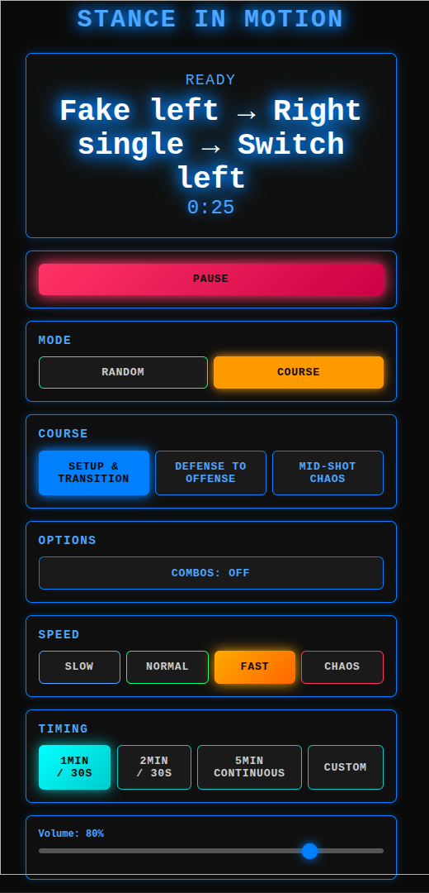
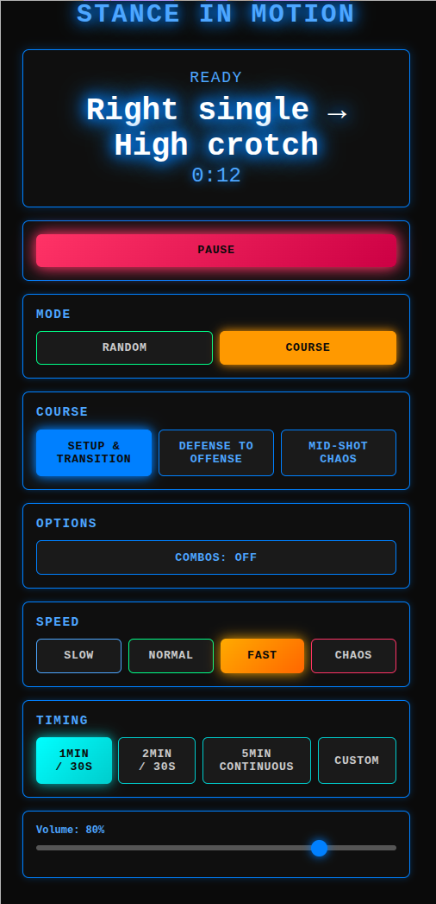

# Wrestling Reaction Trainer

A voice-driven athletic reaction training system for wrestling. Calls out movements, techniques, and combinations in real-time to improve reaction speed, decision-making, and flow.

## Features

- **Voice Callouts**: Text-to-speech announces movements with adjustable speed and rhythm
- **Course Mode**: Structured training sequences (Setup & Transition, Defense to Offense, Mid-Shot Chaos)
- **Random Mode**: Unpredictable combinations with optional combo chains
- **Speed Control**: Slow → Normal → Fast → Chaos with dynamic timing
- **Work/Rest Intervals**: Configurable timing with presets or custom durations
- **Cyberpunk Theme**: Bright blue aesthetic with color-coded controls

## Usage

1. Open `index.html` in a browser
2. Select **Mode** (Random or Course)
3. Choose **Speed** level
4. Set **Timing** (work/rest intervals)
5. Hit **START** and respond to callouts

## Training Modes

### Random Mode
- Pulls from full action library
- Optional combo chains
- Balanced left/right attacks
- Avoids repetition

### Course Mode
Three structured courses with predefined sequences:
- **Setup & Transition**: Fakes → singles → high crotch adjustments
- **Defense to Offense**: Sprawl/down block → counters
- **Mid-Shot Chaos**: Complex chains with switches and transitions

## Actions

- **Movement**: Circle left/right, forward, backward, level change
- **Fakes**: Fake, fake left/right, fake level change
- **Defense**: Sprawl, down block, hip back
- **Attacks**: Sweep single, high crotch, double, left/right single, snatch singles
- **Transitions**: Switch left/right, reshoot, cut the corner

## Speed Levels

- **Slow**: 2.5-3.5s between callouts
- **Normal**: 2.0-2.5s between callouts  
- **Fast**: 1.3-1.8s between callouts
- **Chaos**: 0.7-1.1s between callouts

## Tech

Pure HTML/CSS/JavaScript with Web Speech API. No dependencies.

## License

MIT
